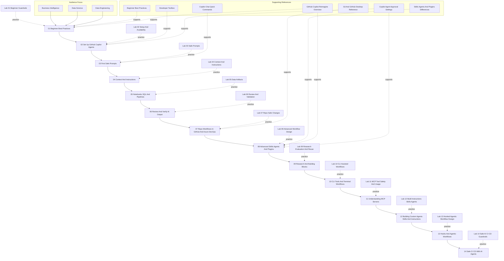

# Curriculum Map

This file provides a visual overview of the current training sequence for BI, data science, and data engineering teams.

## Reading The Map

- Modules 01 through 07 are the beginner core sequence.
- Modules 08 through 14 are the advanced follow-on track.
- Each module has a matching practice lab.
- The first four modules build safe beginner habits.
- Modules 05 through 07 shift into more realistic data-team workflows.
- Modules 08 through 10 establish advanced workflow and CLI foundations.
- Modules 11 through 13 focus on MCP, custom artifacts, hooks, and agentic workflow composition.
- Module 14 focuses on CI/CD guardrails for safe production delivery.
- Supporting references provide standalone lookup material that reinforces specific modules.

## Supporting References To Module Mapping

| Reference | Primary Module |
| --- | --- |
| Beginner Best Practices | 01 Beginner Best Practices |
| Developer Toolbox | 02 Set Up GitHub Copilot Agents |
| Copilot Chat Quick Commands | 03 First Safe Prompts |
| Skills Agents And Plugins Differences | 08 Advanced Skills Agents And Plugins |
| Git And GitHub Desktop Reference | 07 Repo Workflows In GitHub And Azure DevOps |
| GitHub Copilot Reimagine Overview | 01 Beginner Best Practices, 08 Advanced Skills Agents And Plugins |
| Copilot Agent Approval Settings | 02 Set Up GitHub Copilot Agents, 08 Advanced Skills Agents And Plugins, 11 Understanding MCP Servers, 14 Safe CI CD With AI Agents |

## Intended Use

- Use this map in kickoff sessions to explain the full path.
- Use it in facilitator briefings to show where each lab fits.
- Use the reference mapping table to point learners to the right lookup material.
- Update the diagram whenever the curriculum sequence changes.
