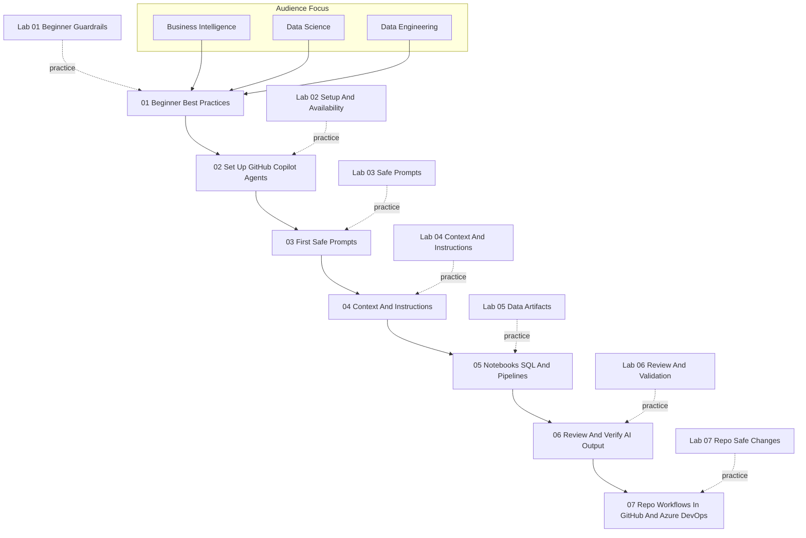

# Curriculum Map

This file provides a visual overview of the current training sequence for BI, data science, and data engineering teams.

## Reading The Map
- Modules 01 through 07 are designed as a progressive sequence.
- Each module has a matching practice lab.
- The first four modules build safe beginner habits.
- Modules 05 through 07 shift into more realistic data-team workflows.

## Intended Use
- Use this map in kickoff sessions to explain the full path.
- Use it in facilitator briefings to show where each lab fits.
- Update the diagram whenever the curriculum sequence changes.
